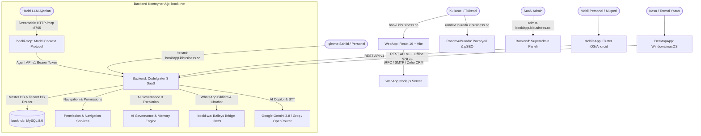

# 🧠 BooKi SaaS — PROJE BEYNİ & SİSTEM HARİTASI (PROJECTMAP)

> **Geliştirici & Üretici Firma:** [Ki Software](https://software.kibusiness.co) (`software.kibusiness.co`)  
> **Ana SaaS Platformu:** [BooKi SaaS](https://bookiapp.kibusiness.co) & [booki.kibusiness.co](https://booki.kibusiness.co)  
> **Tüketici Pazaryeri:** [RandevuBurada](https://randevuburada.kibusiness.co)  
> **Repository:** [miracmk/booki-saas](https://github.com/miracmk/booki-saas)

Bu doküman, BooKi ekosisteminin tüm bileşenlerini, vertical-first mimarisini, rol & yetkilendirme motorunu, yapay zeka yönetişimini, API uç noktalarını, MCP araçlarını, ortam değişkenlerini (ENV), veritabanı ayrımını ve servisler arası veri akışını haritalandıran **merkezi bilgi omurgasıdır**. Hem yazılım geliştiriciler hem de yapay zeka ajanları için **bağlam (context) ve token tasarrufu** sağlayarak tüm sistemin birbiriyle nasıl konuştuğunu tek bakışta sunar.

---

## 🗺️ 1. Mimari Genel Bakış & Servis İletişim Şeması



---

## 🏛️ 2. Vertical-First SaaS Hiyerarşisi

BooKi SaaS, jenerik formlar yerine sektöre özgü terminoloji, ekranlar ve iş modellerini destekleyen standart bir hiyerarşiye sahiptir:

```text
Aile (Family) 
  └── İşletme Tipi (Business Type) 
        └── Sektörel Blueprint (JSON) 
              └── Modül Sistemi (Enabled / Available / Visible / Permission) 
                    └── Dinamik Navigation (12 Grup, Tek Şema) 
                          └── Rol Şablonları (Job Title vs Role Slug) 
                                └── Granular Permissions (10 Aksiyon, 4 Scope, Branch İzolasyonu)
```

### 9 Standart Aile ve İşletme Tipleri
Kaynak: [Backend/application/libraries/Vertical_service.php](file:///opt/ki-ecosystem/ki-reservation-src/Backend/application/libraries/Vertical_service.php)

1. **`beauty_wellness`** (Güzellik, Bakım & Masaj)
   - `beauty_salon` (Güzellik Salonu & Estetik Merkezi)
   - `barber` (Erkek Kuaförü & Berber)
   - `nail_studio` (Protez Tırnak & Nail Art)
   - `massage_spa` (Masaj Salonu, SPA & Hamam)
2. **`restaurant_food`** (Yeme, İçme & Deneyim)
   - `restaurant` (Restoran, Kafe, Bistro, Şef Masası & KDS)
3. **`health_clinical`** (Tıbbi Klinik & Sağlık)
   - `doctor_clinic` (Doktor Özel Klinik & Poliklinik)
   - `dentist` (Diş Kliniği & Dental Sağlık)
   - `psychology_dietitian_clinic` (Psikoloji, Diyet & Beslenme)
4. **`sports_fitness`** (Spor, Fitness & Kulüpler)
   - `gym` (Fitness Salonu & Gym Club)
   - `pilates_studio` (Pilates & Yoga Stüdyosu)
   - `pt_training` (Birebir Personal Training & Özel Koçluk)
   - `sports_court` (Halı Saha, Tenis & Padel Kortları)
5. **`automotive`** (Otomotiv & Araç Bakım)
   - `auto_service_detailing` (Oto Servis, Ekspertiz & Detailing)
   - `car_wash` (Oto Yıkama & Hızlı Temizlik)
6. **`hospitality`** (Konaklama & Turizm)
   - `hotel` (Butik Otel, Bungalov & Tatil Köyü)
7. **`experience`** (Eğlence & Etkinlik)
   - `experience_escape_room` (Kaçış Evi & Deneyim Oyunları)
8. **`education`** (Eğitim & Kurslar)
   - `education` (Özel Kurs, Müzik/Sanat Atölyesi)
9. **`professional`** (Profesyonel Danışmanlık & Hizmet)
   - `law_firm` (Hukuk Bürosu & Avukatlık)
   - `consulting_agency` (Mali Müşavirlik & Yönetim Ajansı)

---

## 📋 3. Blueprint Standart Şeması & Terminoloji Sözlüğü

Konum: [Backend/application/seeders/blueprints/](file:///opt/ki-ecosystem/ki-reservation-src/Backend/application/seeders/blueprints/) (18 Sektörel Blueprint)

Her blueprint JSON dosyasında aşağıdaki 10 blok eksiksiz yer alır:
1. `family`: Üst aile kodu (örn: `restaurant_food`)
2. `business_type`: İşletme tipi kodu (örn: `restaurant`)
3. `terminology`: 12 standart terim sözlüğü (aşağıda listelenmiştir)
4. `enabled_modules`: Sektörde varsayılan aktif gelen modül kodları
5. `navigation`: Sektörel navigation grup ve rota tanımları
6. `roles`: Bu sektörde kullanılan geçerli rol listesi
7. `dashboard`: Owner ve Staff için ayrılmış KPI, canlı durum ve hızlı aksiyon butonları
8. `ai_policy`: Sektörel AI tonu, yasaklı terimler, eskalasyon kuralları ve aksiyon yetkileri
9. `demo_roles`: Canlı rol geçişinde gösterilecek rol kartları ve ikonları
10. `demo_users`: Demo modunda role geçiş yapıldığında atanacak örnek profil verileri

### 12 Standart Terminoloji Anahtarı
Tüm arayüz metinleri `Vertical_service::get_terminology($code)` üzerinden dinamik çözülür:
- `customer`: Müşteri / Danışan / Hasta / Misafir / Üye / Araç Sahibi / Müvekkil
- `provider`: Uzman / Personel / Hekim / Garson / Terapist / Eğitmen / Avukat
- `appointment`: Randevu / Seans / Muayene / Masa Rezervasyonu / Giriş-Çıkış / Duruşma
- `service`: Hizmet / İşlem / Menü & Deneyim / Ders / Yıkama / Danışmanlık
- `station`: İstasyon / Kabin / Koltuk / Muayene Odası / Masa / Kort / Lif / Lift
- `product`: Ürün / Kozmetik / Destek Ürünü / Yiyecek & İçecek / Parça / Ekipman
- `order`: Sipariş / Adisyon / Protokol / Servis Fişi / Danışmanlık Sözleşmesi
- `reservation`: Rezervasyon / Masa Rezervasyonu / Hasta Randevusu / Saha Tahsisi
- `membership`: Üyelik / Sadakat Kulübü / Sağlık Takip Programı / Spor Üyeliği
- `package`: Paket / Seans Paketi / Tedavi Paketi / Fix Menü / Yıkama Paketi
- `catalog`: Katalog / Hizmet Kataloğu / Menü / Tedavi Listesi / Ders Kataloğu
- `branch`: Şube / Klinik / Salon / Restoran / Tesis

---

## 🧭 4. Dinamik Menü & Sidebar Mimarisi (`Navigation_service`)

Konum: [Backend/application/libraries/Navigation_service.php](file:///opt/ki-ecosystem/ki-reservation-src/Backend/application/libraries/Navigation_service.php)  
Görünüm: [Backend/application/views/components/backend_header.php](file:///opt/ki-ecosystem/ki-reservation-src/Backend/application/views/components/backend_header.php)

- **Tek Şema Mimarisi:** Sidebar menüsü ve mobil offcanvas menüsü aynı `navigation_service()->forCurrentUser()` çıktısından render edilir.
- **12 Standart Menü Grubu:**
  1. `dashboard`: Dashboard & Hızlı Genel Bakış
  2. `operations`: Takvim, Canlı Ajanda, Bekleme Listesi, Canlı Masa Planı / Kiosk
  3. `crm`: Müşteriler, Hasta Kayıtları, Danışan Profilleri, Sadakat Puanları
  4. `catalog`: Birleşik Ortak Katalog (Hizmetler, Ürünler, Paketler, Üyelikler)
  5. `resources`: İstasyonlar, Odalar, Masalar, Cihazlar & Kortlar
  6. `team`: Personel, Çalışma Saatleri, Vardiyalar & İzinler
  7. `finance`: Adisyonlar, POS (Hızlı Satış), Kasa, Gelir/Gider, Faturalar
  8. `marketing`: Kampanyalar, Toplu SMS/WhatsApp, Google/Meta Reklamları, RandevuBurada
  9. `vertical`: Sektörel Özel Modüller (QR Menü, KDS, Klinik Dosyası, Kort Maçları vb.)
  10. `reports`: Finansal Raporlar, Personel Hakediş, Doluluk Analitikleri
  11. `ai`: AI Copilot & Ajan Ayarları
  12. `settings`: Şubeler, Sektör Ayarları, Genel Ayarlar, Denetim Kayıtları (Audit Log)
- **Filtreleme Katmanı:** Her menü öğesi `module_enabled($module)` ve `permission_service->can($action, $resource)` kontrollerinden geçer; yetkisiz veya kapalı menüler tamamen elenir. Boş kalan gruplar UI'da gösterilmez.

---

## 📦 5. Birleşik Ortak Katalog Sistemi (`Catalog`)

Konum: [Backend/application/controllers/Catalog.php](file:///opt/ki-ecosystem/ki-reservation-src/Backend/application/controllers/Catalog.php)  
Görünüm: [Backend/application/views/pages/catalog.php](file:///opt/ki-ecosystem/ki-reservation-src/Backend/application/views/pages/catalog.php)

Farklı domain modellerini (`services`, `products`, `packages`, `membership_plans`) yapay tek bir veritabanı tablosuna sıkıştırmak yerine, UI katmanında sektöre göre dinamik organize eden bir abstraction katmanıdır:
- **Beauty & Wellness:** Hizmetler / Bakımlar, Satış Ürünleri, Seans Paketleri, Üyelikler
- **Restaurant & Food:** Menü Öğeleri, Menü Grupları, İçecekler & Ürünler, Ekstralar, Tadım Paketleri
- **Clinical & Health:** Muayene & Tıbbi İşlemler, Medikal Destek Ürünleri, Tedavi Protokol Paketleri
- **Sports & Fitness:** Dersler & Seanslar, Spor Ürünleri, Üyelik Planları, Paket Seanslar

---

## 🛡️ 6. Rol, Yetki (RBAC + Scope) & Şube İzolasyon Motoru

Kütüphane: [Backend/application/libraries/Permission_service.php](file:///opt/ki-ecosystem/ki-reservation-src/Backend/application/libraries/Permission_service.php)  
Model: [Backend/application/models/Roles_model.php](file:///opt/ki-ecosystem/ki-reservation-src/Backend/application/models/Roles_model.php)

### A. İş Unvanı (`job_title`) ve Yetki Rolü (`role_slug`) Ayrımı
Kullanıcının kartvizit unvanı ile sistem güvenlik yetkisi birbirinden tamamen bağımsızdır:
- `job_title`: *"Kıdemli Dermatolog"*, *"Salon Şefi"*, *"Baş Fizyoterapist"*
- `role_slug`: *"doctor"*, *"waiter"*, *"professional"*, *"owner"*

### B. 22 Hazır Rol Şablonu (Migration 170)
- **Restoran:** `owner`, `general_manager`, `floor_manager`, `waiter`, `cashier`, `kitchen`, `bar`
- **Klinik:** `owner`, `clinic_manager`, `doctor`, `nurse`, `reception`, `cashier`
- **Güzellik & Spa:** `owner`, `manager`, `reception`, `professional`, `therapist`, `cashier`, `inventory`
- **Fitness & Spor:** `owner`, `manager`, `reception`, `trainer`, `group_instructor`, `cashier`

### C. 10 Granular Yetki Aksiyonu
`view`, `add`, `edit`, `delete`, `approve`, `export`, `manage`, `refund`, `override`, `execute`.

### D. 4 Seviyeli Yetki Kapsamı (Scope Hierarchy)
```text
own (Kendi Kaydı) < assigned (Kendisine Atanmışlar) < branch (Tüm Şube) < all (Tüm İşletme / Tüm Şubeler)
```
- Örnek: Garson yalnızca `appointments.view.assigned` ve `adisyons.add.branch` yetkisine sahipken; Şube Müdürü `financial_reports.view.branch`, İşletme Sahibi ise `financial_reports.view.all` yetkisine sahiptir.
- **Multi-Branch İzolasyonu:** `Permission_service::check_branch_access($user_id, $branch_id)` fonksiyonu `ea_user_branches` ve `ea_users.branch_ids` üzerinden kontrol yaparak personelin yetkisiz olduğu şube verilerine erişmesini engeller.

---

## 🔒 7. Backend Route Güvenliği (`App_Controller`)

Konum: [Backend/application/core/App_Controller.php](file:///opt/ki-ecosystem/ki-reservation-src/Backend/application/core/App_Controller.php)  
Metot: `enforce_route_permissions()`

Menüde gizleme tek başına bir güvenlik mekanizması değildir. Doğrudan URL girişleri (Direct URL access) constructor aşamasında kontrol edilir:
- İlgili controller'ın gerektirdiği modül (`module_enabled`) kapalıysa -> **HTTP 403 Forbidden**.
- Kullanıcının rolü ilgili modül veya aksiyon için yetkisizse (`cannot('view', $resource)`) -> **HTTP 403 Forbidden**.
- Public veya auth gerektirmeyen sayfalar (`login`, `booking`, `marketplace`, `webhooks`) muaf tutulur.

---

## 🤖 8. AI Yönetişimi, Yetkileri, Bellek & Eskalasyon Motoru

Kütüphane: [Backend/application/libraries/Ai_governance_service.php](file:///opt/ki-ecosystem/ki-reservation-src/Backend/application/libraries/Ai_governance_service.php)  
Denetleyici: [Backend/application/controllers/Ai_agent.php](file:///opt/ki-ecosystem/ki-reservation-src/Backend/application/controllers/Ai_agent.php)

### A. Effective Policy Intersection
Yapay zeka asistanının uygulayacağı nihai kurallar kümesi 3 katmanın kesişimiyle hesaplanır:
```text
Etkin AI Politikası = İşletme AI Politikası (ea_tenant_ai_policies) 
                     ∩ Sektörel Blueprint Politikası (ai_policy) 
                     ∩ Kullanıcının Yetki Kapsamı (User Permissions)
```

### B. 5 Seviyeli AI Araç İcazeti (Clearance Levels)
1. `forbidden`: Aracın kullanımı kesinlikle engellenir (HTTP 403 / Red cevabı).
2. `read`: Sadece veri sorgulama ve okuma amaçlı araçlar.
3. `suggest`: Kullanıcıya taslak öneri sunma.
4. `propose`: Randevu oluşturma, veri güncelleme gibi işlemleri taslak onay butonlarıyla sunma.
5. `execute`: Doğrudan çalıştırma (yalnızca Owner / Admin yetkisinde düşük riskli işlemler).
> **Kritik Kural:** AI asistanı, o an oturum açmış personelin yetki sınırlarını hiçbir koşulda aşamaz.

### C. Kontrollü Davranış Öğrenme Hattı (Controlled Learning Pipeline)
AI kendi kendine işletme politikasını veya kurallarını değiştiremez. Öğrenme süreci 5 aşamalı insan denetimli hattan geçer:
```text
Observed (Gözlemlendi) 
  ──> Suggested (AI Kural Önerdi) 
        ──> Owner Approval (İşletme Sahibi Onayı) 
              ──> Business Rule (İşletme Kuralına Dönüştü) 
                    ──> Active (Aktif Sistem Promptuna Enjekte Edildi)
```

### D. Çok Alanlı Eskalasyon & İnsan Devri (Human Handoff)
Kullanıcı mesajlarında riskli konular tespit edildiğinde anında sınıflandırılır ve `ea_ai_escalation_handoffs` tablosuna kayıt açılarak görevli personele bildirilir:
1. `medical`: İlaç, alerji, kanama, ağrı, reçete (Yetkili: Hekim/Doktor)
2. `legal`: Dava, mahkeme, savcılık, ihtarname, KVKK ihlali (Yetkili: Hukuk Sorumlusu/Owner)
3. `payment`: Fazla çekim, chargeback, izinsiz işlem, kart itirazı (Yetkili: Kasa / Finans Müdürü)
4. `angry_customer`: Rezalet, berbat, dolandırıcılık, şikayetçiyim (Yetkili: İşletme Sahibi / GM)
5. `uncertainty`: AI güven skorunun düşük kaldığı belirsiz durumlar

---

## 🎭 9. Canlı Demo Rol Değiştirici (`Demo_service`)

Kütüphane: [Backend/application/libraries/Demo_service.php](file:///opt/ki-ecosystem/ki-reservation-src/Backend/application/libraries/Demo_service.php)

Müşterilere veya test kullanıcılarına farklı rollerin sistemdeki deneyimini anında göstermek için geliştirilmiştir:
- Blueprint'teki `demo_roles` ve `demo_users` verisini kullanır.
- `demo_service->switch_role('waiter')` çağrıldığında:
  - Oturum `role_slug`, `job_title` ve `is_admin` parametreleriyle güncellenir.
  - Sidebar ve mobil menü anında Garson menüsüne dönüşür.
  - Dashboard sadece Garson KPI'larını gösterir.
  - Finans, raporlar ve sistem ayarlarına erişim backend seviyesinde kilitlenir.

---

## 🌐 10. Domain & Routing Haritası

| Domain | Port / Upstream | Denetleyici / Servis | Açıklama |
| :--- | :--- | :--- | :--- |
| `booki.kibusiness.co` | `127.0.0.1:8091` &rarr; `booki-website` | [WebApp/server/index.ts](file:///opt/ki-ecosystem/ki-reservation-src/WebApp/server/index.ts) | React 19 vitrin, özellikler, fiyatlandırma, demo & deneme talepleri |
| `bookiapp.kibusiness.co` | `80` &rarr; `booki-app` | `Booking.php` / `Landing.php` | SaaS genel müşteri randevu karşılama ve ana platform |
| `admin-bookiapp.kibusiness.co` | `80` &rarr; `booki-app` | `Superadmin_auth.php`, `Superadmin_tenants.php` | Çok kiracılı SaaS lisans, kiracı oluşturma ve sistem ayarları |
| `{tenant}-bookiapp.kibusiness.co` | `80` &rarr; `booki-app` | `Calendar.php`, `Appointments.php`, `Catalog.php` | Kiracıya özel personel ajandası, müşteri listesi ve POS ekranı |
| `randevuburada.kibusiness.co` | `80` &rarr; `booki-app` | `Marketplace.php`, `Places_photo.php` | Tüketici keşif pazaryeri, pSEO kategorileri ve Google Places profilleri |
| `127.0.0.1:3039` | `3000` &rarr; `booki-wa` | [Backend/deploy/bridge](file:///opt/ki-ecosystem/ki-reservation-src/Backend/deploy/bridge) | Baileys izole WhatsApp oturum köprüsü |
| Port `8765` | `8765` &rarr; `booki-mcp` | [Backend/deploy/mcp](file:///opt/ki-ecosystem/ki-reservation-src/Backend/deploy/mcp) | LLM Ajanları için HTTP Streamable MCP Sunucusu |

---

## 📡 11. API Uç Noktaları Kataloğu

### A. Mobil & Entegrasyon REST API v1 (`/api/v1/`)
Kimlik Doğrulama: `Authorization: Bearer <jwt_or_api_token>`

| Metot | Uç Nokta | Denetleyici Dosyası | Açıklama |
| :--- | :--- | :--- | :--- |
| `POST` | `/api/v1/auth/login` | `Auth_api_v1.php` | İki aşamalı giriş; admin, personel veya müşteri rolünü saptar |
| `POST` | `/api/v1/auth/refresh` | `Auth_api_v1.php` | Oturum token yenileme |
| `POST` | `/api/v1/auth/logout` | `Auth_api_v1.php` | Güvenli çıkış |
| `GET` | `/api/v1/operations/live` | `Operations_api_v1.php` | Canlı kuyruk, masa sayaçları, geri sayım kartları |
| `POST` | `/api/v1/operations/quick_status` | `Operations_api_v1.php` | Randevu durumu güncelleme (Geldi, Başladı, Tamamlandı) |
| `GET` | `/api/v1/operations/stations` | `Operations_api_v1.php` | İstasyon ve sandalye/masa doluluk durumu |
| `GET` | `/api/v1/appointments` | `Appointments_api_v1.php` | Randevuları listeleme ve filtreleme |
| `POST` | `/api/v1/appointments` | `Appointments_api_v1.php` | Yeni randevu oluşturma (çakışma ve süre kontrolüyle) |
| `PUT` | `/api/v1/appointments/:id` | `Appointments_api_v1.php` | Randevu güncelleme veya erteleme |
| `DELETE`| `/api/v1/appointments/:id` | `Appointments_api_v1.php` | Randevu iptal etme |
| `GET` | `/api/v1/customers` | `Customers_api_v1.php` | Müşteri arama ve listeleme |
| `GET` | `/api/v1/customers/:id/crm` | `Customers_api_v1.php` | Müşteri geçmişi, harcama istatistikleri ve sadakat puanları |
| `GET` | `/api/v1/services` | `Services_api_v1.php` | Hizmet kataloğu, fiyat ve süreler |
| `GET` | `/api/v1/stations` | `Stations_api_v1.php` | İstasyon / Masa / Koltuk tanımları |
| `GET` | `/api/v1/verticals` | `Verticals_api_v1.php` | Sektörel dinamik form ve kayıtlar (klinik, kuaför, oto servis vb.) |

### B. Yapay Zeka Ajan API'si (`/agent/v1/`)
Kimlik Doğrulama: `Authorization: Bearer <agent_api_token>` + `X-Tenant` başlığı.

| Metot | Uç Nokta | Açıklama |
| :--- | :--- | :--- |
| `GET` | `/agent/v1/business` | İşletme çalışma saatleri, tatiller ve rezervasyon kuralları |
| `GET` | `/agent/v1/services` | Hizmet listesi, süre, fiyat ve kategori eşleşmesi |
| `GET` | `/agent/v1/providers` | Hizmet veren personel, uzmanlıklar ve çalışma saatleri |
| `GET` | `/agent/v1/availability` | Belirli tarih, personel ve hizmet için dinamik boş slotlar |
| `GET` | `/agent/v1/customer_lookup` | Telefon, e-posta veya isimle müşteri arama |
| `POST` | `/agent/v1/create_appointment` | Ajan tarafından anında randevu oluşturma |
| `POST` | `/agent/v1/handoff` | AI sohbetini canlı personele devretme protokolü |

---

## 🤖 12. Model Context Protocol (MCP) Konfigürasyonu (`booki-mcp`)

Sunucu: [Backend/deploy/mcp/reservation-mcp/server.js](file:///opt/ki-ecosystem/ki-reservation-src/Backend/deploy/mcp/reservation-mcp/server.js)  
Port: `8765` | Transport: `StreamableHTTPServerTransport` | Base Path: `/mcp`

### 17 Kayıtlı MCP Aracı:
1. `business`: İşletme çalışma saatleri, tatil günleri, adres ve rezervasyon kuralları.
2. `services`: Sunulan tüm hizmetler, süreler ve fiyatlar.
3. `providers`: Randevu kabul eden uzmanlar ve personel.
4. `availability`: Belirtilen tarih/hizmet için anlık boş randevu slotları.
5. `customer_lookup`: Müşteri bilgilerini arama ve doğrulama.
6. `customer_appointments`: Müşterinin geçmiş ve gelecek randevularını çekme.
7. `stations`: Sandalye, masa ve klinik istasyon durumları.
8. `vertical_records`: Sektörel özel form ve medikal/bakım kayıtları.
9. `create_appointment`: Müşteri adına randevu kaydetme.
10. `reschedule_appointment`: Randevu saatini değiştirme.
11. `cancel_appointment`: Randevuyu iptal etme.
12. `marketing_campaigns`: Reklam kampanyalarını inceleme.
13. `marketing_toggle_campaign`: Reklam kampanyasını durdurma/başlatma.
14. `marketing_realtime`: Canlı reklam harcaması ve dönüşüm verisi.
15. `marketing_analytics`: Detaylı pazarlama ve ROI raporu.
16. `marketing_attributions`: Randevuların reklam kaynak ilişkilendirmesi.
17. `request_human_handoff`: Sohbeti insan personele aktarma protokolü.

---

## 🗄️ 13. Veritabanı Mimarisi & Yeni Tablolar (Migrations 169 & 170)

```text
[MySQL 8.0: booki-db]
│
├── 📁 ki_reservation_master (Master DB)
│   ├── tenants                     # Subdomain, durum, db_name, db_user, custom_domain
│   ├── superadmins                 # Platform yöneticileri
│   ├── leads                       # RandevuBurada işletme havuzu & zenginleştirilmiş pSEO verileri
│   └── google_places_crawler_jobs  # Crawler tarama görevleri
│
└── 📁 {tenant_db_name} (Örn: salonflora_db, izole kiracı DB'leri)
    ├── appointments                # Randevular
    ├── customers                   # Müşteri verileri, sadakat puanları
    ├── services                    # Hizmet kataloğu
    ├── service_categories          # Kategoriler
    ├── users                       # Personel (job_title, role_slug, branch_ids eklendi)
    ├── roles                       # Roller (permissions_json, vertical_family, business_type eklendi)
    ├── user_branches               # Çok şubeli personel-şube eşleşmeleri (YENİ - M170)
    ├── tenant_ai_policies          # Tenant bazlı AI kuralları ve ton politikası (YENİ - M170)
    ├── ai_learned_rules            # AI davranış öğrenme hattı kayıtları (YENİ - M170)
    ├── ai_escalation_handoffs      # İnsan devri ve kriz eskalasyon kayıtları (YENİ - M170)
    ├── adisyons                    # POS adisyonları, ödeme kalemleri
    ├── stations                    # Sandalye / masa / oda tanımları
    └── settings                    # Kiracıya özel çalışma saatleri & kurallar
```

---

## 🔐 14. Ortam Değişkenleri (Environment Variables) Kataloğu

| Değişken Adı | Varsayılan / Örnek | Açıklama |
| :--- | :--- | :--- |
| `BASE_URL` | `https://bookiapp.kibusiness.co` | CLI ve arka plan işleri için kök adres |
| `TENANT_APP_DOMAIN` | `bookiapp.kibusiness.co` | Kiracı subdomain çözümleme kök domaini |
| `SUPERADMIN_DOMAIN` | `admin-bookiapp.kibusiness.co` | SaaS yönetim paneli domaini |
| `MARKETPLACE_DOMAIN` | `booki.kibusiness.co` | Vitrin ve tanıtım domaini |
| `RANDEVUBURADA_DOMAIN` | `randevuburada.kibusiness.co` | Tüketici pazaryeri domaini |
| `DB_HOST` | `db` | MySQL konteyner adı |
| `DB_NAME` | `ki_reservation_master` | Master tenant kataloğu veritabanı adı |
| `BOOKI_APP_KEY` | `***` | Oturum ve çerez şifreleme anahtarı |
| `TENANT_MASTER_KEY` | `***` | Kiracı veritabanı şifreleme anahtarı |
| `GEMINI_API_KEY` | `***` | Google Gemini 3.8 Yapay Zeka API anahtarı |
| `WA_BRIDGE_URL` | `http://booki-wa:3000` | Dahili WhatsApp bridge adresi |
| `WA_BRIDGE_SECRET` | `***` | Bridge erişim güvenlik parolası |

---

## 🧪 15. Test Kapsamı & Doğrulama Matrisi

Sistem, [Backend/tests/Integration/VerticalRolePermissionIntegrationTest.php](file:///opt/ki-ecosystem/ki-reservation-src/Backend/tests/Integration/VerticalRolePermissionIntegrationTest.php) entegrasyon paketi ve ana PHPUnit test süiti ile korunmaktadır:

| Test Senaryosu | Kapsam & Kontroller | Durum |
| :--- | :--- | :--- |
| `testVerticalFamilyResolutionAndTerminology` | 9 standart aile, masaj spa eşleşmesi, klinik eşleşmesi, 12 standart terim | ✅ GEÇTİ |
| `testRestaurantRolesMatrix` | Owner, General Manager, Waiter, Cashier, Kitchen yetki ve menü kontrolleri | ✅ GEÇTİ |
| `testClinicRolesMatrix` | Owner, Doctor, Nurse, Reception, Cashier yetki, hasta ve EHR dosya kontrolleri | ✅ GEÇTİ |
| `testBeautyRolesMatrix` | Owner, Reception, Professional yetki matrisi | ✅ GEÇTİ |
| `testSpaRolesMatrix` | Owner, Reception, Therapist yetki ve seans erişimleri | ✅ GEÇTİ |
| `testFitnessRolesMatrix` | Trainer, Owner yetki, antrenman ve ders kontrolleri | ✅ GEÇTİ |
| `testMultiBranchScopeEnforcement` | Yetkili şube erişimi, yetkisiz şube reddi | ✅ GEÇTİ |
| `testAiGovernanceSuite` | Yetki tavanı, 4 alanlı eskalasyon (medical, legal, payment, angry), öğrenme hattı | ✅ GEÇTİ |
| `testDemoRoleSwitcher` | Canlı rol değiştirme, oturum durumu, yetki izolasyonu | ✅ GEÇTİ |

**Genel Test Paketi Özeti:**  
`OK (9 tests, 137 assertions)` — Entegrasyon Süiti  
`Tests: 460, Assertions: 7036, Errors: 0` — Tüm Sistem Süiti

---

## 📜 16. Geliştirici & Ajan Notları

1. **İzole Kiracı Çözümlemesi:** Her istek `App_Controller::resolve_tenant()` tarafından host başlığına bakılarak ilgili kiracı veritabanına bağlanır.
2. **Kural Koruma:** Mevcut çalışan müşteri ve randevu özellikleri hiçbir koşulda geriye dönük uyumsuzluk yaratacak şekilde bozulamaz.
3. **Telif:** Tüm hakları saklıdır. Geliştirici: **Ki Software** ([software.kibusiness.co](https://software.kibusiness.co)).
