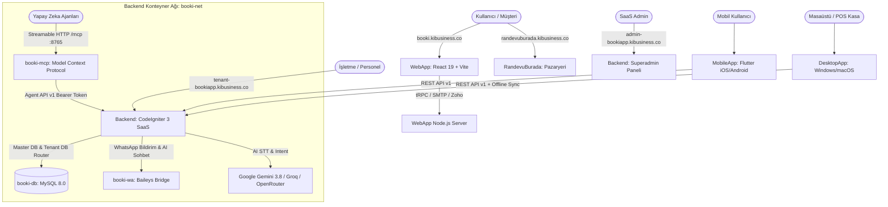

# 🧠 BooKi SaaS — PROJE BEYNİ & SİSTEM HARİTASI (PROJECTMAP)

> **Geliştirici & Üretici Firma:** [Ki Software](https://software.kibusiness.co) (`software.kibusiness.co`)  
> **Ana SaaS Platformu:** [BooKi SaaS](https://bookiapp.kibusiness.co) & [booki.kibusiness.co](https://booki.kibusiness.co)  
> **Tüketici Pazaryeri:** [RandevuBurada](https://randevuburada.kibusiness.co)  
> **Repository:** [miracmk/booki-saas](https://github.com/miracmk/booki-saas)

Bu doküman, BooKi ekosisteminin tüm bileşenlerini, API uç noktalarını, MCP araçlarını, ortam değişkenlerini (ENV), veritabanı ayrımını ve servisler arası veri akışını haritalandıran **merkezi bilgi omurgasıdır**. Hem yazılım geliştiriciler hem de yapay zeka ajanları için **bağlam (context) ve token tasarrufu** sağlayarak tüm sistemin birbiriyle nasıl konuştuğunu tek bakışta sunar.

---

## 🗺️ 1. Mimari Genel Bakış & Servis İletişim Şeması



---

## 🌐 2. Domain & Routing Haritası

Tüm domain yönlendirmeleri [Nginx Proxy Manager](http://localhost:81) ve [Backend/application/core/App_Controller.php](file:///opt/ki-ecosystem/ki-reservation-src/Backend/application/core/App_Controller.php) / [Backend/application/config/routes.php](file:///opt/ki-ecosystem/ki-reservation-src/Backend/application/config/routes.php) üzerinden dinamik olarak çözülür:

| Domain | Port / Upstream | Denetleyici / Servis | Açıklama |
| :--- | :--- | :--- | :--- |
| `booki.kibusiness.co` | `127.0.0.1:8091` &rarr; `booki-website` | [WebApp/server/index.ts](file:///opt/ki-ecosystem/ki-reservation-src/WebApp/server/index.ts) | React 19 vitrin, özellikler, fiyatlandırma, demo & deneme talepleri |
| `bookiapp.kibusiness.co` | `80` &rarr; `booki-app` | `Booking.php` / `Landing.php` | SaaS genel müşteri randevu karşılama ve ana platform |
| `admin-bookiapp.kibusiness.co` | `80` &rarr; `booki-app` | `Superadmin_auth.php`, `Superadmin_tenants.php` | Çok kiracılı SaaS lisans, kiracı oluşturma ve sistem ayarları |
| `{tenant}-bookiapp.kibusiness.co` | `80` &rarr; `booki-app` | `Calendar.php`, `Appointments.php`, `Pos.php` | Kiracıya özel personel ajandası, müşteri listesi ve POS ekranı |
| `randevuburada.kibusiness.co` | `80` &rarr; `booki-app` | `Marketplace.php`, `Places_photo.php` | Tüketici keşif pazaryeri, pSEO kategorileri ve Google Places profilleri |
| `127.0.0.1:3039` | `3000` &rarr; `booki-wa` | [Backend/deploy/bridge](file:///opt/ki-ecosystem/ki-reservation-src/Backend/deploy/bridge) | Baileys izole WhatsApp oturum köprüsü |
| Port `8765` | `8765` &rarr; `booki-mcp` | [Backend/deploy/mcp](file:///opt/ki-ecosystem/ki-reservation-src/Backend/deploy/mcp) | LLM Ajanları için HTTP Streamable MCP Sunucusu |

---

## 📡 3. Tüm API Uç Noktaları Kataloğu

### A. Mobil & Entegrasyon REST API v1 (`/api/v1/`)
Konum: [Backend/application/controllers/api/v1/](file:///opt/ki-ecosystem/ki-reservation-src/Backend/application/controllers/api/v1/)  
Kimlik Doğrulama: `Authorization: Bearer <jwt_or_api_token>` veya oturum çerezi.

| Metot | Uç Nokta | Denetleyici Dosyası | Açıklama |
| :--- | :--- | :--- | :--- |
| `POST` | `/api/v1/auth/login` | `Auth_api_v1.php` | İki aşamalı giriş; admin veya müşteri rolünü otomatik saptar |
| `POST` | `/api/v1/auth/refresh` | `Auth_api_v1.php` | Oturum token yenileme |
| `POST` | `/api/v1/auth/logout` | `Auth_api_v1.php` | Güvenli çıkış ve oturum iptali |
| `GET` | `/api/v1/operations/live` | `Operations_api_v1.php` | Canlı kuyruk, masa sayaçları, geri sayım kartları, istasyonlar |
| `POST` | `/api/v1/operations/quick_status` | `Operations_api_v1.php` | Randevu durumu güncelleme (Geldi, Başladı, Tamamlandı, İptal) |
| `GET` | `/api/v1/operations/stations` | `Operations_api_v1.php` | Aktif istasyon ve sandalye/masa doluluk durumu |
| `POST` | `/api/v1/operations/assign_station` | `Operations_api_v1.php` | Randevuyu belirli bir istasyona atama |
| `GET` | `/api/v1/appointments` | `Appointments_api_v1.php` | Randevuları listeleme (filtreleme, tarih aralığı) |
| `GET` | `/api/v1/appointments/:id` | `Appointments_api_v1.php` | Tekil randevu detayları |
| `POST` | `/api/v1/appointments` | `Appointments_api_v1.php` | Yeni randevu oluşturma (çakışma ve süre kontrolüyle) |
| `PUT` | `/api/v1/appointments/:id` | `Appointments_api_v1.php` | Randevu güncelleme veya erteleme |
| `DELETE` | `/api/v1/appointments/:id` | `Appointments_api_v1.php` | Randevu iptal etme |
| `GET` | `/api/v1/availabilities` | `Availabilities_api_v1.php` | Sağlayıcı ve hizmet bazlı müsait zaman dilimleri |
| `GET` | `/api/v1/customers` | `Customers_api_v1.php` | Müşteri arama ve listeleme |
| `GET` | `/api/v1/customers/:id` | `Customers_api_v1.php` | Müşteri profili |
| `GET` | `/api/v1/customers/:id/crm` | `Customers_api_v1.php` | Müşteri geçmişi, harcama istatistikleri ve sadakat puanları |
| `POST` | `/api/v1/customers` | `Customers_api_v1.php` | Yeni müşteri kartı açma |
| `PUT` | `/api/v1/customers/:id` | `Customers_api_v1.php` | Müşteri bilgilerini güncelleme |
| `GET` | `/api/v1/services` | `Services_api_v1.php` | Hizmet kataloğu, fiyat ve süreler |
| `GET` | `/api/v1/service_categories` | `Service_categories_api_v1.php` | Hizmet kategorileri |
| `GET` | `/api/v1/providers` | `Providers_api_v1.php` | Personel ve uzman listesi, çalışma planları |
| `GET` | `/api/v1/stations` | `Stations_api_v1.php` | İstasyon / Masa / Koltuk tanımları |
| `GET` | `/api/v1/verticals` | `Verticals_api_v1.php` | Sektörel dinamik form ve kayıtlar (klinik, kuaför, oto servis vb.) |
| `GET` | `/api/v1/settings` | `Settings_api_v1.php` | İşletme çalışma saatleri ve rezervasyon kuralları |
| `POST` | `/api/v1/webhooks` | `Webhooks_api_v1.php` | Dış entegrasyonlar için webhook kaydı oluşturma |

---

### B. Yapay Zeka Ajan API'si (`/agent/v1/`)
Konum: [Backend/application/controllers/Agent_api.php](file:///opt/ki-ecosystem/ki-reservation-src/Backend/application/controllers/Agent_api.php)  
Kimlik Doğrulama: `Authorization: Bearer <agent_api_token>` + `Host: {tenant}-bookiapp.kibusiness.co` (veya `X-Tenant` başlığı).

| Metot | Uç Nokta | Açıklama |
| :--- | :--- | :--- |
| `GET` | `/agent/v1/business` | İşletme çalışma saatleri, iletişim, mola ve rezervasyon limitleri |
| `GET` | `/agent/v1/services` | Hizmet listesi, süre, fiyat, açıklama ve kategori eşleşmesi |
| `GET` | `/agent/v1/providers` | Hizmet veren personel, uzmanlıklar ve çalışma saatleri |
| `GET` | `/agent/v1/stations` | Fiziksel salon/klinik istasyonları ve kapasiteleri |
| `GET` | `/agent/v1/vertical_data` | Sektöre özgü form şemaları ve doldurulmuş özel alanlar |
| `GET` | `/agent/v1/availability` | Belirli tarih, personel ve hizmet için dinamik boş slotlar |
| `GET` | `/agent/v1/customer_lookup` | Telefon, e-posta veya isimle müşteri eşleştirme |
| `GET` | `/agent/v1/customer_appointments/:id` | Müşterinin yaklaşan ve geçmiş randevuları |
| `POST` | `/agent/v1/create_appointment` | Ajan tarafından anında randevu oluşturma ve onay bildirimi |
| `POST` | `/agent/v1/reschedule_appointment/:id` | Randevu tarih ve saatini yeniden planlama |
| `POST` | `/agent/v1/cancel_appointment/:id` | Randevuyu gerekçe belirterek iptal etme |
| `GET` | `/agent/v1/marketing_campaigns` | Google & Meta aktif reklam kampanyaları |
| `POST` | `/agent/v1/marketing_toggle_campaign` | Reklam kampanyasını duraklatma veya başlatma |
| `GET` | `/agent/v1/marketing_realtime` | Anlık tıklama, gösterim ve reklam harcaması |
| `GET` | `/agent/v1/marketing_analytics` | Dönüşüm oranı, CPA ve ROI analitikleri |
| `GET` | `/agent/v1/marketing_attributions` | Randevuların reklam kaynak ilişkilendirmesi |
| `POST` | `/agent/v1/handoff` | AI sohbetini canlı personele devretme protokolü |

---

### C. WhatsApp Webhook & Bridge API (`booki-wa`)
Konum: [Backend/deploy/bridge/src/server.js](file:///opt/ki-ecosystem/ki-reservation-src/Backend/deploy/bridge/src/server.js)  
Port: `127.0.0.1:3039` (Konteyner içi: `3000`) | Güvenlik: `X-Bridge-Secret`

| Metot | Uç Nokta | Açıklama |
| :--- | :--- | :--- |
| `GET` | `/health` | Bridge sağlık kontrolü ve aktif Baileys oturum sayısı |
| `POST` | `/v1/session/:tenant/start` | Kiracı için WhatsApp QR kodu üretme veya oturumu bağlama |
| `GET` | `/v1/session/:tenant/status` | QR kodu (`qr_data_url`), bağlantı durumu (`connected`, `connecting`, `idle`) |
| `POST` | `/v1/session/:tenant/logout` | WhatsApp Web oturumunu sonlandırma ve oturum dosyalarını silme |
| `POST` | `/v1/send` | WhatsApp mesajı (metin, buton veya şablon) gönderme |
| `POST` | `/whatsapp/webhook` | Meta resmi WhatsApp Cloud API webhook alıcısı (CSRF muaf) |
| `POST` | `/whatsapp/bridge_webhook` | `booki-wa` bridge'den gelen gelen mesajları alan uygulama endpoint'i |

---

### D. RandevuBurada Pazaryeri & pSEO Uç Noktaları
Konum: [Backend/application/controllers/Marketplace.php](file:///opt/ki-ecosystem/ki-reservation-src/Backend/application/controllers/Marketplace.php)  
Domain: `https://randevuburada.kibusiness.co`

| Metot | Uç Nokta | Açıklama |
| :--- | :--- | :--- |
| `GET` | `/` | Pazaryeri ana arama, öne çıkan işletmeler, şehir ve sektör filtreleri |
| `GET` | `/kategori/:sector` | Sektör bazlı işletme listesi (örn: `/kategori/kuafor`) |
| `GET` | `/kategori/:sector/:city` | İl bazlı pSEO listelemesi (örn: `/kategori/klinik/bursa`) |
| `GET` | `/kategori/:sector/:city/:district` | İlçe bazlı pSEO listelemesi (örn: `/kategori/berber/istanbul/kadikoy`) |
| `GET` | `/business/:subdomain` | Kayıtlı BooKi SaaS kiracısının genel vitrin ve doğrudan randevu sayfası |
| `GET` | `/isletme/:slug` | Google Places Crawler ile kataloglanan zenginleştirilmiş işletme sayfası |
| `GET` | `/sahiplen/:token` | İşletme sahiplenme ve BooKi SaaS kiracısına dönüştürme sihirbazı |
| `POST` | `/isletme/contact` | Ziyaretçi doğrudan randevu ve bilgi talep formu |
| `GET` | `/api/places/photo` | Google API anahtarını gizleyen güvenli fotoğraf proxy'si |
| `GET` | `/sitemap.xml` | Şehir, ilçe ve kategorileri içeren dinamik arama motoru haritası |
| `GET` | `/robots.txt` & `/llms.txt` | Arama motorları ve AI tarayıcıları için kurallar |

---

## 🤖 4. Model Context Protocol (MCP) Konfigürasyonu (`booki-mcp`)

Sunucu: [Backend/deploy/mcp/reservation-mcp/server.js](file:///opt/ki-ecosystem/ki-reservation-src/Backend/deploy/mcp/reservation-mcp/server.js)  
Port: `8765` | Transport: `StreamableHTTPServerTransport` | Base Path: `/mcp`

### Bağlantı Parametreleri:
- **URL Formatı:** `http://<sunucu-ip>:8765/mcp?tenant=<subdomain>&token=<agent_api_key>`
- **HTTP Başlıkları:**
  - `X-Tenant`: Kiracı subdomain'i
  - `Authorization`: `Bearer <agent_api_key>`

### 17 Kayıtlı MCP Aracı (Tool Listesi):
1. `business`: İşletme çalışma saatleri, tatil günleri, adres ve rezervasyon kuralları.
2. `services`: Sunulan tüm hizmetler, süreler ve fiyatlar.
3. `providers`: Randevu kabul eden uzmanlar ve personel.
4. `availability`: Belirtilen tarih/hizmet için anlık boş randevu slotları.
5. `customer_lookup`: Müşteri bilgilerini arama ve doğrulama.
6. `customer_appointments`: Müşterinin geçmiş ve gelecek randevularını çekme.
7. `stations`: Sandalye, masa ve klinik istasyon durumları.
8. `vertical_records`: Sektörel özel form ve medikal/bakım kayıtları.
9. `create_appointment`: Müşteri adına randevu kaydetme.
10. `reschedule_appointment`: Randevu saatini değiştirme.
11. `cancel_appointment`: Randevuyu iptal etme.
12. `marketing_campaigns`: Reklam kampanyalarını inceleme.
13. `marketing_toggle_campaign`: Reklam kampanyasını durdurma/başlatma.
14. `marketing_realtime`: Canlı reklam harcaması ve dönüşüm verisi.
15. `marketing_analytics`: Detaylı pazarlama ve ROI raporu.
16. `marketing_attributions`: Randevuların kaynak analizleri.
17. `request_human_handoff`: Sohbeti insan personele aktarma protokolü.

---

## 🔐 5. Ortam Değişkenleri (Environment Variables) Kataloğu

### Backend Servisleri (`booki-app`, `booki-db`, `booki-wa`, `booki-mcp`)
Kaynak: [Backend/deploy/docker-compose.yml](file:///opt/ki-ecosystem/ki-reservation-src/Backend/deploy/docker-compose.yml) & [Backend/deploy/.env](file:///opt/ki-ecosystem/ki-reservation-src/Backend/deploy/.env)

| Değişken Adı | Varsayılan / Örnek | Açıklama |
| :--- | :--- | :--- |
| `BASE_URL` | `https://bookiapp.kibusiness.co` | CLI ve arka plan işleri için kök adres |
| `TENANT_APP_DOMAIN` | `bookiapp.kibusiness.co` | Kiracı subdomain çözümleme kök domaini |
| `SUPERADMIN_DOMAIN` | `admin-bookiapp.kibusiness.co` | SaaS yönetim paneli domaini |
| `MARKETPLACE_DOMAIN` | `booki.kibusiness.co` | Vitrin ve tanıtım domaini |
| `RANDEVUBURADA_DOMAIN` | `randevuburada.kibusiness.co` | Tüketici pazaryeri domaini |
| `DB_HOST` | `db` | MySQL konteyner adı |
| `DB_NAME` | `ki_reservation_master` | Master tenant kataloğu veritabanı adı |
| `DB_USERNAME` | `ki_reservation_master` | Veritabanı kullanıcısı |
| `DB_PASSWORD` | `***` | Veritabanı parolası |
| `DB_ROOT_PASSWORD` | `***` | MySQL root parolası |
| `BOOKI_APP_KEY` | `***` | Oturum ve çerez şifreleme anahtarı |
| `TENANT_MASTER_KEY` | `***` | Kiracı veritabanı şifreleme anahtarı |
| `BACKUP_ENCRYPTION_KEY` | `***` | Veritabanı yedek şifreleme anahtarı |
| `GEMINI_API_KEY` | `***` | Google Gemini 3.8 Yapay Zeka API anahtarı |
| `GROQ_API_KEY` | `***` | Groq Whisper & LLM yedek API anahtarı |
| `OPENROUTER_API_KEY` | `***` | Admin paneli AI Ajanı API anahtarı |
| `AI_AGENT_MODEL` | `openrouter/free` | Ajan modeli |
| `WA_BRIDGE_URL` | `http://booki-wa:3000` | Dahili WhatsApp bridge adresi |
| `WA_BRIDGE_SECRET` | `***` | Bridge erişim güvenlik parolası |
| `GOOGLE_PLACES_API_KEY` | `AIzaSy...` | Places Crawler ve fotoğraf proxy anahtarı |
| `GOOGLE_CLIENT_ID` | `***` | Google Takvim senkronizasyon OAuth Client ID |
| `GOOGLE_CLIENT_SECRET` | `***` | Google Takvim senkronizasyon OAuth Secret |

### WebApp (`booki-website`)
Kaynak: [WebApp/docker-compose.yml](file:///opt/ki-ecosystem/ki-reservation-src/WebApp/docker-compose.yml) & [WebApp/.env](file:///opt/ki-ecosystem/ki-reservation-src/WebApp/.env)

| Değişken Adı | Varsayılan / Örnek | Açıklama |
| :--- | :--- | :--- |
| `NODE_ENV` | `production` | Node.js çalışma ortamı |
| `PORT` | `3000` | Konteyner içi dinleme portu (Host: 8091) |
| `SMTP_HOST` | `mail.kibusiness.co` | E-posta sunucu adresi |
| `SMTP_PORT` | `587` | E-posta portu |
| `SMTP_USER` | `***` | E-posta kullanıcı adı |
| `SMTP_PASSWORD` | `***` | E-posta parolası |
| `DEMO_RECIPIENT` | `satis@kibusiness.co` | Gelen demo ve deneme talepleri alıcı adresi |
| `ZOHO_CLIENT_ID` | `***` | Platform seviyesi Zoho CRM OAuth Client ID |
| `ZOHO_CLIENT_SECRET` | `***` | Zoho CRM Client Secret |
| `ZOHO_REDIRECT_URI` | `https://booki.kibusiness.co/api/zoho/oauth/callback` | Zoho OAuth dönüş adresi |

---

## 🗄️ 6. Veritabanı Mimarisi & Çok Kiracılı Ayrım

```
[MySQL 8.0: booki-db]
│
├── 📁 ki_reservation_master (Master DB)
│   ├── tenants                     # Subdomain, durum, db_name, db_user, custom_domain
│   ├── superadmins                 # Platform yöneticileri
│   ├── settings                    # Platform global ayarları
│   ├── leads                       # RandevuBurada işletme havuzu & zenginleştirilmiş pSEO verileri
│   ├── google_places_crawler_jobs  # Crawler tarama görevleri
│   └── google_places_crawler_results
│
└── 📁 {tenant_db_name} (Örn: salonflora_db, izole kiracı DB'leri)
    ├── appointments                # Randevular
    ├── customers                   # Müşteri verileri, sadakat puanları
    ├── services                    # Hizmet kataloğu
    ├── service_categories          # Kategoriler
    ├── users                       # Personel (providers), sekreterler, adminler
    ├── adisyons                    # POS adisyonları, ödeme kalemleri
    ├── stations                    # Sandalye / masa / oda tanımları
    ├── vertical_records            # Sektörel dinamik form kayıtları
    ├── messaging_settings          # WhatsApp bridge oturum ve şablon ayarları
    └── settings                    # Kiracıya özel çalışma saatleri & kurallar
```

---

## 📱 7. Mobil & Masaüstü Uygulama Mimarisi

- **MobileApp (Flutter):**
  - Durum Yönetimi: `flutter_riverpod` (v3)
  - HTTP İstemcisi: `dio` (v5) ile `/api/v1/` REST bağlantısı
  - QR Kod Tarama: `mobile_scanner` (v7) ile personel karşılama ekranı
  - Depolama: `flutter_secure_storage` ile güvenli JWT ve kiracı kodu saklama
- **DesktopApp (Flutter Desktop - Windows & macOS):**
  - Donanım İletişimi: USB / COM / TCP ESC/POS termal adisyon yazıcı protokolü
  - Yerel Önbellek: SQLite offline-first randevu veritabanı
  - Arka Plan İşi: Bağlantı kurulduğunda `Operations_api_v1.php` ile çift yönlü senkronizasyon

---

## 🎯 8. Geliştirici & Ajan Hızlı Başvuru Notları

1. **Kiracı Çözümleme Mantığı:** Her HTTP isteği `App_Controller::resolve_tenant()` tarafından host başlığına bakarak ilgili veritabanına bağlanır. Master DB'de sadece `admin-bookiapp`, `booki.kibusiness.co` ve `randevuburada.kibusiness.co` kalır.
2. **Sıfır Kesinti Kuralı:** Kod tabanında yapılan güncellemeler sembolik linkler (`symlinks`) sayesinde hem monorepo içindeki yeni dizinlerden (`Backend/`, `WebApp/`) hem de eski yollardan kesintisiz çalışır.
3. **Marka Bütünlüğü:** Tüm telif ve geliştirici referansları **Ki Software** (`software.kibusiness.co`), ürün referansları ise **BooKi** ve **RandevuBurada** olarak tutulmalıdır.
