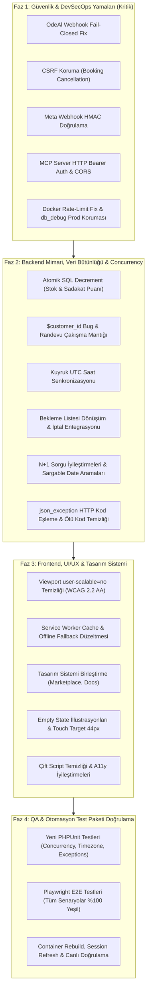

# 🛡️ BooKi — Kapsamlı Sistem Denetim & Eylem Planı (QA, Güvenlik, Frontend, Backend)

**Tarih:** 18 Eylül 2026  
**Kanonik Kaynak:** `/opt/ki-ecosystem/ki-reservation-src`  
**Denetim Kapsamı:** QA & SDET, Güvenlik & DevSecOps, Frontend UI/UX & Tasarım Sistemi, Backend Mimari & Veri Bütünlüğü  

---

## 📑 İçindekiler
1. [Yönetici Özeti & Denetim Skor Tablosu](#1-yönetici-özeti--denetim-skor-tablosu)
2. [Ajan Denetim Raporları Özeti](#2-ajan-denetim-raporları-özeti)
   - [2.1 QA & Güvenilirlik Denetimi](#21-qa--güvenilirlik-denetimi)
   - [2.2 Güvenlik & DevSecOps Denetimi](#22-güvenlik--devsecops-denetimi)
   - [2.3 Frontend & UI/UX Tasarım Sistemi Denetimi](#23-frontend--uiux-tasarım-sistemi-denetimi)
   - [2.4 Backend Sistemleri & Veritabanı Mimarisi Denetimi](#24-backend-sistemleri--veritabanı-mimarisi-denetimi)
3. [Önceliklendirilmiş Uygulama Planı (Faz 1 - Faz 4)](#3-önceliklendirilmiş-uygulama-planı)
4. [Kod Düzeltme & İyileştirme Yol Haritası](#4-kod-düzeltme--iyileştirme-yol-haritası)

---

## 1. Yönetici Özeti & Denetim Skor Tablosu

| Disiplin / Alan | Mevcut Durum | Kritik / Yüksek Bulgular | Hedef Durum (Faz Sonrası) |
| :--- | :---: | :--- | :---: |
| **Güvenlik (DevSecOps)** | 🚨 Yüksek Risk | ÖdeAl fail-open imza açığı, Meta webhook HMAC eksikliği, MCP HTTP auth eksikliği, CSRF bypass, Docker IP rate-limit bypass | 🛡️ Zero-Trust & OWASP %100 Uyumlu |
| **Backend & Veri Bütünlüğü** | 🚨 Yüksek Risk | Sadakat puanı & stok düşümünde race condition, N+1 sorgu kaskatları, pagination kıran bellek filtreleri, non-sargable DATE() aramaları | ⚙️ Atomik SQL & Optimize Eager Loading |
| **QA & Güvenilirlik** | ⚠️ Orta Risk | `$customer_id` undefined hatası, çakışma kontrolü boşlukları, bekleme listesi dönüşüm kopukluğu, UTC/yerel saat kuyruk senkronu | 🧪 %100 Kapsamlı PHPUnit & Playwright E2E |
| **Frontend & UI/UX** | ⚠️ İyileştirme Gerekli | `user-scalable=no` WCAG ihlali, sw.js 404 cache bug'ı, boş durum (empty-state) eksikleri, touch-target (<44px) darlığı, inline CSS'ler | 🎨 8pt Grid, WCAG 2.2 AA & PWA Mükemmeliyeti |

---

## 2. Ajan Denetim Raporları Özeti

### 2.1 QA & Güvenilirlik Denetimi
- **[C-01] Undefined `$customer_id`:** `Appointment_booking_service.php:176` içinde `$customer_id` tanımlanmadan sorguya gönderiliyor, mükerrer randevu engellemesi sessizce devre dışı kalıyor.
- **[C-02] Hatalı Kısmi Çakışma Mantığı:** `Booking.php:502` ve `Appointment_booking_service.php:177` yalnızca yeni randevuyu tamamen kapsayan randevuları çakışma sayıyor; kısmi örtüşmeler (örn. 10:00-11:00 ile 10:30-11:30) geçiyor.
- **[C-03] Doğrudan API/CRUD Çakışma Kontrolü Eksikliği:** `Appointments::store()` ve `Appointments::update()` doğrudan `save()` çağırıyor, `has_provider_conflict` kontrolleri yalnızca Takvim controller'ında kalmış.
- **[C-04] Bekleme Listesi Dönüşüm Çağrısı:** `Waitlist_model::mark_converted()` tanımlı fakat hiçbir yerde çağrılmıyor; randevu oluşturan bekleme listesi müşterileri bildirim almaya devam ediyor.
- **[C-05] Kuyruk Saat Dilimi Uyuşmazlığı:** `Jobs_model.php` yerel saat (`date()`) kullanırken `Queue.php` UTC kullanıyor; gecikmeli işler anında çalışıyor.
- **[H-01] İptal Linki Eksiklikleri:** `Booking_cancellation.php` iptal sonrası bekleme listesi tetiklemesini ve kapora iadesini çalıştırmıyor.
- **[H-02] Çalışma Planı İstisna Dilimleme:** Çok günlük izinler tek bir gün silindiğinde tüm aralığı siliyor, aralığı bölmüyor.
- **[H-03] İstasyon Kilit Sızıntısı:** `Appointment_booking_service.php` catch bloğunda `release_station_locks` garanti edilmiyor.
- **[H-04] Yuvarlama Hatası:** `Reports_model.php` komisyon ve hakedişleri `round($payout, 2)` yapmadan ham float topluyor.

### 2.2 Güvenlik & DevSecOps Denetimi
- **[VULN-01 - Kritik] ÖdeAl Webhook Fail-Open:** `Odeal_gateway.php:155-170` secret veya imza başlığı boş olduğunda `return true;` dönüyor. Saldırgan sahte ödeme bildirimi ile randevuyu "ödendi" yapabilir.
- **[VULN-02 - Yüksek] MCP HTTP Transport Kimliksiz:** `deploy/mcp/reservation-mcp/server.js` HTTP modunda bearer token doğrulamıyor ve `Access-Control-Allow-Origin: *` kullanıyor.
- **[VULN-03 - Yüksek] Meta Webhook HMAC Eksikliği:** `Whatsapp.php` ve `Instagram.php` webhook POST endpoint'leri `X-Hub-Signature-256` HMAC kontrolü yapmıyor.
- **[VULN-04 - Yüksek] İptal Sayfası CSRF Açığı:** `Booking_cancellation.php` CSRF korumasından muaf ve manuel kontrol yapmıyor.
- **[VULN-05 - Yüksek] Docker Rate-Limit Bypass:** `rate_limit_helper.php` özel IP bloklarını (`172.*`, `10.*`) muaf tutuyor; Docker arkasında tüm istekler `172.x` geldiği için rate limit tamamen devre dışı kalıyor.
- **[VULN-06 - Orta] Canlıda db_debug Açık:** `App_Controller.php:247` tenant bağlantısında `'db_debug' => true` sabit kodlanmış, hata durumunda SQL sızdırıyor.
- **[VULN-07 - Orta] İyzico Header Case & Replay:** `Iyzico_gateway.php` imza başlığını büyük harfle arıyor ve replay koruması içermiyor.
- **[VULN-08 - Orta] Agent Müşteri PII Sızıntısı:** `Agent_api::customer_lookup` 2 karakterli joker sorgularla çok geniş müşteri listesi ve maskelenmemiş telefon/e-posta dönüyor.

### 2.3 Frontend & UI/UX Tasarım Sistemi Denetimi
- **[UI-01] Viewport Zoom Kısıtlaması (WCAG 2.2 AA SC 1.4.4):** 10 layout/view dosyasında `user-scalable=no` kullanılmış.
- **[UI-02] Service Worker 404 Cache Hatası:** `sw.js` mevcut olmayan `/assets/css/app.min.css` dosyasını önbelleğe almaya çalışıyor ve SW kurulumu sessizce çöküyor.
- **[UI-03] Pazar Yeri & Docs Tasarım Tutarsızlığı:** `marketplace_index.php`, `marketplace_business.php` ve `docs.php` harici CSS ve inline stillerle ana tasarım sisteminden kopmuş.
- **[UI-04] 5 Bileşen Durumu Eksiklikleri:** Müşteriler (`customers.php`) ve Değerlendirmeler (`reviews.php`) tablolarında veri olmadığında boş kutu kalıyor (Empty State illüstrasyonu ve CTA butonu yok).
- **[UI-05] Mobil Dokunmatik Alanlar (<44px):** Renk seçim butonları (`.color-selection-option`) ve tarih seçici butonları 32x32px; en az 44x44px olmalı.
- **[UI-06] Çift Script Yüklemesi:** `message_layout.php` içinde `bootstrap.min.js` iki kez yükleniyor.

### 2.4 Backend Sistemleri & Veritabanı Mimarisi Denetimi
- **[BE-01] Sadakat Puanı & Stok Çift Harcama:** `Loyalty_points_model.php` ve `Products_model.php` bakiye ve stok kontrollerini PHP'de yapıp statik değer yazıyor. Eşzamanlı isteklerde eksiye düşme ve çift harcama riski var.
- **[BE-02] Müşteri Arama & Takvim N+1 Sorgu Kaskatları:** `Customers::search` 100 müşteride ~900 SQL sorgusu çalıştırıyor. `Calendar.php` takvim görünümünde her randevu için tek tek müşteri/sağlayıcı sorguluyor.
- **[BE-03] Sayfalamayı Bozan Bellek-İçi Filtreleme:** `Appointments.php` ve `Customers.php` SQL'den LIMIT 50 çekip PHP'de `unset()` ile sağlayıcı/sekreter filtresi uyguluyor, sayfalar 0-2 kayıtla dönüyor.
- **[BE-04] Non-Sargable DATE() Sorguları:** `Appointments_model.php` ve `Dashboard.php` B-Tree indekslerini devre dışı bırakan `DATE(start_datetime) = ?` kullanıyor.
- **[BE-05] `json_exception` HTTP 500 Zorlaması:** `http_helper.php` tüm istisnaları HTTP 500'e çeviriyor (400, 404, 422 kodlarını yutuyor).
- **[BE-06] Ölü Kod & Çift Fonksiyonlar:** `http_helper.php` içinde çift `response()` tanımı, `User.php` kullanılmayan yönlendirme dosyası.
- **[BE-07] Domain Sabitleri Tutarsızlığı:** `routes.php`, `App_Controller.php` ve `Landing.php` arasında varsayılan domain fallback'leri uyumsuz.

---

## 3. Önceliklendirilmiş Uygulama Planı

---

## 4. Kod Düzeltme & İyileştirme Yol Haritası

### Adım 1: Güvenlik Açıklarının Kapatılması
- `application/libraries/payment/Odeal_gateway.php`
- `application/controllers/Booking_cancellation.php`
- `application/controllers/Whatsapp.php` & `Instagram.php`
- `deploy/mcp/reservation-mcp/server.js`
- `application/helpers/rate_limit_helper.php` & `application/config/config.php`
- `application/core/App_Controller.php`

### Adım 2: Backend Concurrency, Bug & Performans Düzeltmeleri
- `application/models/Loyalty_points_model.php` & `Products_model.php`
- `application/libraries/Appointment_booking_service.php` & `application/controllers/Booking.php`
- `application/models/Jobs_model.php` & `application/libraries/Queue.php`
- `application/models/Working_plan_exceptions_model.php`
- `application/helpers/http_helper.php` & `application/controllers/User.php`
- `application/models/Appointments_model.php` & `application/controllers/Customers.php`

### Adım 3: Frontend & UI/UX İyileştirmeleri
- `application/views/layouts/*.php` (Viewport düzeltmesi)
- `sw.js` (CSS yolları ve offline fallback)
- `application/views/pages/marketplace_*.php` & `docs.php`
- `assets/css/general.scss` (Touch target boyutları)
- `application/views/pages/customers.php` & `reviews.php` (Empty states)

### Adım 4: QA Test Paketi & Canlı Doğrulama
- `tests/Unit/` yeni test sınıfları
- `docker compose build app && docker compose up -d app`
- `npx playwright test tests/e2e/auth.setup.spec.js`
- Full test paketi koşumu (`tests/Unit` ve `tests/e2e`)
